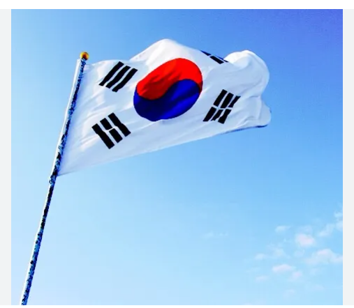

<!DOCTYPE html>
<html lang="en">
<head>
    <meta charset="UTF-8">
    <meta name="viewport" content="width=device-width, initial-scale=1.0">
    <title>WDD 131 - Dynamic Web Fundamentals - Your Name</title>
    <meta name="description" content="WDD 131 - Dynamic Web Fundamentals. Your Full Name. Keyword summary of page content">
    <meta name="author" content="Your Full Name">
    <link rel="stylesheet" href="styles/base.css">
    
    <link href="https://fonts.googleapis.com/css2?family=Roboto:wght@400;700&display=swap" rel="stylesheet">
</head>
<body>
    <header>
        <h1>Page Heading</h1>
        <nav>
            <ul>
                <li><a href="https://www.linkedin.com/">LinkedIn Profile</a></li>
                <li><a href="https://byui.instructure.com/">I-Learn</a></li>
                <li><a href="https://www.churchofjesuschrist.org/study/scriptures">Scriptures</a></li>
                <li><a href="#">Final Project</a></li>
            </ul>
        </nav>
    </header>
    <main>
        <section class="card">
            <h2>Section 1</h2>
            
I am a Korean lawyer specializing in legal advice and litigation. 
               As a male attorney, I provide comprehensive legal services to my 
               clients, ensuring their rights are protected and their legal issues 
               are effectively resolved. With extensive experience in various 
               legal fields, I am dedicated to delivering the best possible outcomes.

            
            <ul>
                <li><a href="#">Resource 1</a></li>
                <li><a href="#">Resource 2</a></li>
                <li><a href="#">Resource 3</a></li>
            </ul>
        </section>
        <section class="card">
            <h2>Section 2</h2>
            
Korea is a vibrant country located in East Asia, 
                known for its rich cultural heritage, technological advancements, 
                and dynamic economy. It boasts stunning landscapes, from bustling 
                cities like Seoul to serene countryside. Renowned for K-pop, 
                delicious cuisine, and historical sites, Korea seamlessly blends 
                tradition and modernity, making it a captivating destination for 
                travelers and a leader in innovation.

            
            <ul>
                <li><a href="#">Resource 1</a></li>
                <li><a href="#">Resource 2</a></li>
                <li><a href="#">Resource 3</a></li>
            </ul>
        </section>
    </main>
    <footer>
        
&copy;  Your Full Name, Korea

        

    </footer>
</body>
</html>
